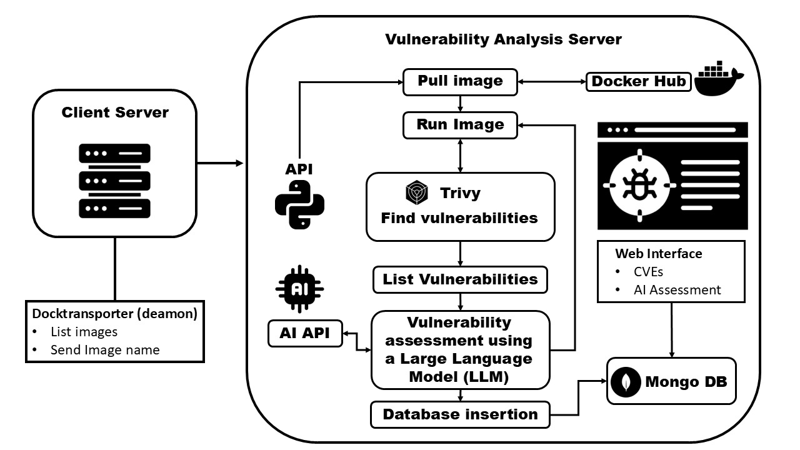

[](https://www.linkedin.com/in/mateus-brito-bitencourt-497a30223)
[](https://www.linkedin.com/in/gabriel-brito-bitencourt-a847b922a)


# Sumário

- [📌 Visão Geral](#-visão-geral)
- [🏗️ Arquitetura do Sistema](#%EF%B8%8F-arquitetura-do-sistema)
  - [Diagrama de Fluxo e Componentes](#diagrama-de-fluxo-e-componentes)
  - [Fluxo de Execução e Processamento de Dados](#fluxo-de-execu%C3%A7%C3%A3o-e-processamento-de-dados)
  - [Tecnologias Principais](#tecnologias-principais)
- [📋 Requisitos](#-requisitos)
- [⚙️ Instalação](#%EF%B8%8F-instala%C3%A7%C3%A3o)
  - [Server A](#server-a)
  - [Server B](#server-b)
  - [Web Server](#web-server)
- [⚙️ Configuração](#%EF%B8%8F-configura%C3%A7%C3%A3o)
  - [Server A](#server-a-1)
  - [Server B](#server-b-1)
  - [Web Server](#web-server-1)
- [🤔 Como usar o DockShield?](#-como-usar-o-dockshield)
- [🗂️ Estrutura do Programa](#%EF%B8%8F-estrutura-do-programa)
  - [➡️ Server A](#%EF%B8%8F-server-a)
  - [➡️ Server B](#%EF%B8%8F-server-b)
  - [➡️ Web Server](#%EF%B8%8F-web-server)
 - [😃 Autores](#-autores)
 - [📝 Licença](#-licen%C3%A7a)

# 📌 Visão Geral

**DockShield** é um programa de **automatização de análises de contêineres Docker**, que utiliza **LLMs (Large Language Models)** para interpretar e detalhar vulnerabilidades encontradas.  
O principal diferencial do projeto é **a velocidade**, permitindo analisar **centenas de vulnerabilidades por dia**, oferecendo insights rápidos e confiáveis para equipes de segurança.

O projeto é organizado em **três módulos principais**, cada um em um diretório específico:

| Diretório       | Função                                                                                  |
|-----------------|----------------------------------------------------------------------------------------|
| **server_a/**   | Contém os códigos que devem ser executados no **servidor analisado**, onde as imagens Docker estão rodando. |
| **server_b/**   | Contém os códigos do **servidor de análise**, responsável por orquestrar a execução do Trivy, processar os resultados e gerar relatórios detalhados. |
| **server_web/** | Contém os códigos para subir um **servidor web Apache**, permitindo a visualização dos resultados das análises em uma interface web. |

💡 **Resumo:** O DockShield conecta os três módulos para criar um fluxo de análise altamente eficiente:  
**Imagens Docker → Análise automatizada rápida → Resultados acessíveis via web.**

---

# 🏗️ Arquitetura do Sistema

O **DockShield** utiliza uma **Arquitetura Distribuída Cliente-Servidor (Client-Server)**, implementada através de três módulos logicamente separados que atuam em diferentes domínios de rede.

## Diagrama de Fluxo e Componentes

O diagrama a seguir ilustra o fluxo completo de dados, desde a requisição de análise no **Client Server** até a persistência e visualização dos relatórios enriquecidos pela Inteligência Artificial.



## Fluxo de Execução e Processamento de Dados

O sistema opera através de um fluxo sequencial e automatizado no **Vulnerability Analysis Server**, acionado remotamente pelo cliente:

1.  **Iniciação:** O **Client Server** (módulo `server_a/`), que hospeda o *daemon* **Docktransporter**, envia o **nome da imagem** desejada para análise via **API** ao **Vulnerability Analysis Server** (`server_b/`).
2.  **Preparação:** O **Vulnerability Analysis Server** realiza o *pull* da imagem a partir do **Docker Hub** e executa o contêiner.
3.  **Varredura:** O *scanner* **Trivy** é executado para identificar vulnerabilidades (CVEs, configurações incorretas, etc.) e listar os resultados brutos.
4.  **Inteligência e Enriquecimento (O Core):** Os dados brutos são enviados para a **AI API** para o **Vulnerability assessment using a Large Language Model (LLM)**. O LLM provê contexto, severidade customizada e sugestões de remediação para cada vulnerabilidade.
5.  **Persistência:** O relatório final, agora enriquecido pela IA, é persistido no banco de dados **Mongo DB** para acesso futuro.
6.  **Visualização:** O **Web Interface** (`server_web/`) consulta o **Mongo DB** e apresenta os relatórios de análise (CVEs e AI Assessment) ao usuário.


## Tecnologias Principais

O sistema foi desenvolvido utilizando **Python** como linguagem principal de *backend* e orquestração. As tecnologias específicas são:

* **Linguagem de Orquestração:** **Python**.
* **Banco de Dados (Persistência):** **Mongo DB** (escolhido por sua flexibilidade em armazenar documentos não estruturados, ideal para os relatórios dinâmicos do LLM).
* **Scanner:** **Trivy** (utilizado para varredura de contêineres e sistemas de arquivos).
* **Inteligência:** **Large Language Model (LLM)**, acessado via **API**, para processamento de linguagem natural e enriquecimento de dados.

---

# 📋 Requisitos

Para que o **DockShield** funcione corretamente, é necessário atender aos seguintes requisitos:

- **Servidor de banco de dados MongoDB**  
  - Para armazenar os relatórios criados pela LLM e as CVEs.

- **Chave de API de LLM**  
  - Compatível com a biblioteca Python da OpenAI, usada para interpretar e resumir vulnerabilidades.

- **Chave de API do NVDLib**  
  - Necessária para consultar a base de dados de vulnerabilidades NVD e obter informações detalhadas sobre cada CVE.

- **Três servidores rodando Ubuntu Server**  
  - **Server A:** servidor onde as imagens Docker que serão analisadas estão rodando.  
  - **Server B:** servidor de análise que processa os resultados.  
  - **Web Server:** servidor web Apache para visualização dos resultados.
---

# ⚙️ Instalação

## Server A
O **Server A** é o servidor onde as imagens Docker que serão analisadas estão rodando.
### Passo 1: Clonar o repositório
```bash
git clone https://github.com/BitencourtDevProjects/DockShield-Public.git
```
### Passo 2: Dar permissões de execução para o instalador
```bash
sudo chmod u+x ./DockShield/server_a/install.sh
```
### Passo 3: Executar arquivo de instalação
```bash
sudo ./DockShield/server_a/install.sh
```
## Server B
O "server B" é o servidor que irá orquestrar a análise das imagens pelas LLMs
### Passo 1: Clonar o repositório
```bash
git clone https://github.com/BitencourtDevProjects/DockShield-Public.git
```
### Passo 2: Dar permissões de execução para o instalador
```bash
sudo chmod u+x ./DockShield/server_b/install.sh
```
### Passo 3: Executar arquivo de instalação
```bash
sudo ./DockShield/server_b/install.sh
```
## Web Server
O "Web Server" é o servidor que será usado para visualizar os dados obtidos via web.
### Passo 1: Clonar o repositório
```bash
git clone https://github.com/BitencourtDevProjects/DockShield-Public.git
```
### Passo 2: Dar permissões de execução para o instalador
```bash
sudo chmod u+x ./DockShield/server_web/install.sh
```
### Passo 3: Executar arquivo de instalação
```bash
sudo ./DockShield/server_web/install.sh
```
---

# ⚙️ Configuração
Após instalado, o projeto precisa ser configurado com informações específicas que variam de usuário para usuário. Como endereços IP e Chaves de API.
## Server A
### Passo 1: Abra as configurações do Server A
```bash
sudo nano /etc/dock_transporter/config.ini
```
### Passo 2: Edite o arquivo config.ini
```ini
[SERVER]
host = 192.168.0.1
port = 8000
```
- **host:** Coloque o `IP` do Server B
- **port:** Pode manter o padrão `8000`, a menos que exista um motivo específico para alterar.
### Passo 3: Recarregue o serviço para aplicar as configurações
```bash
sudo systemctl restart dock_transporter.service
sudo systemctl daemon-reload
```
## Server B
### Passo 1: Abra as configurações do Server B
```bash
sudo nano /etc/dockshield/ai_config.ini
```
### Passo 2: Edite o arquivo ai_config.ini
```ini
[AI]
api_key = 

base_url = https://api.openai.com/v1
# Gemini: https://generativelanguage.googleapis.com/v1beta/openai/
# Deepseek: https://api.deepseek.com
# OpenAI: https://api.openai.com/v1
# Grok: https://api.x.ai/v1

model = 

[NVDLIB]
api_key = 

[DATABASE]
location = 
port = 27017
```
- **[AI] api_key:** Coloque a chave de API da LLM que será utilizada para análise;
- **base_url:** A url atrelada a LLM que será utilizada, existem exemplos no arquivo `ai_config.ini` mas recomendamos que busque a url na documentação da API da LLM;
- **model:** O modelo de LLM que será utilizado para fazer a análise;
- **[NVDLIB] api_key:** A chave de API do NVDLib
- **location:** O `IP` do servidor que está rodando o MongoDB
- **port:** A porta onde o MongoDB está escutando, por padrão é a porta `27017`

### Passo 3: Recarregue o serviço para aplicar as configurações
```bash
sudo systemctl restart dockshield.service
sudo systemctl daemon-reload
```
## Web Server
### Abra as configurações do Web Server
```bash
sudo nano /var/www/server_web/web_config.ini
```
### Passo 2: Edite o arquivo web_config.ini
```ini
[DATABASE]
collection = DockShield
location = 
port = 27017
```
- **collection:** Nome da collection onde os dados estão armazenados, por padrão é DockShield, não mecher a não ser que saiba o que está fazendo.
- **location:** O `IP` do servidor que está rodando o MongoDB
- **port:** A porta onde o MongoDB está escutando, por padrão é a porta `27017`

### Passo 3: Edite o arquivo server_web.conf
```bash
sudo nano /etc/apache2/sites-available/server_web.conf
```
Coloque o IP do seu servidor no campo `serverName`
```bash
<VirtualHost *:80>
#Coloque o Ip do seu servidor
    ServerName 192.168.0.00

    WSGIDaemonProcess server_web threads=5
    WSGIScriptAlias / /var/www/server_web/app.wsgi

    <Directory /var/www/server_web>
        Require all granted
    </Directory>

    Alias /static /var/www/server_web/static
    <Directory /var/www/server_web/static>
        Require all granted
    </Directory>

    ErrorLog ${APACHE_LOG_DIR}/server_web_error.log
    CustomLog ${APACHE_LOG_DIR}/server_web_access.log combined
</VirtualHost>
```

### Passo 3: Recarregue o serviço para aplicar as configurações
```bash
sudo systemctl restart apache2.service
sudo systemctl daemon-reload
```
---

# 🤔 Como usar o DockShield?
Após a configuração ter sido completata basta usar esse comando no Servidor A.
```bash
sudo dock_transporter run
```


Após isso a análise irá inicar automaticamente

# 🗂️ Estrutura do Programa
## ➡️ Server A
O diretório "server_a" contem os seguintes arquivos.

### `config.ini`
É o arquivo de configuração do Servidor A. Aqui é colocado o IP e a porta do servidor B.

### `dock_transporter.py`
Este script, opera como um daemon em sistemas GNU/Linux. Sua principal responsabilidade é coletar uma lista de todas as imagens Docker presentes localmente e enviar essa lista para o Servidor B.

O script inicia estabelecendo configurações essenciais, como a leitura de parâmetros do arquivo `/etc/dock_transporter/config.ini` e a configuração de um sistema de logging que registra eventos em `/var/log/dock_transporter.log`. A rotina principal é a função `coletar()`, que executa o comando docker images para listar todos os repositórios e tags de imagens locais e, em seguida, transmite essa lista por meio de uma requisição HTTP POST para o servidor configurado no arquivo `config.ini`. O daemon implementa o processo de daemonização padrão do Unix, usando dois `forks` para se desanexar do terminal, e mantém-se ativo em um loop de espera de 60 segundos. Crucialmente, ele registra um handler de sinal para o `SIGUSR1` (para execução imediata da `coletar()`) e outro handler para o `SIGTERM` (para encerramento ordenado pelo systemd).

### `dock_transporter.service`
É um arquivo `unit do systemd` que configura o serviço daemon garantindo que o dock_transporter.py seja iniciado automaticamente no sistema e que seja reiniciado sempre que parar de funcionar.

### `dock_transporter.sh`
Este script em Bash funciona como uma interface de linha de comando para o daemon `dock_transporter.py`. Quando chamado com o argumento `run`, o script localiza o ID de Processo (PID) do daemon ativo lendo o arquivo `/var/run/dock_transporter.pid`. Em seguida, ele utiliza o comando `kill` para enviar o sinal `SIGUSR1` ao daemon. Este sinal, é uma instrução programática para que o daemon execute imediatamente sua função interna `coletar`, que é responsável por enviar imagens Docker para análise.

### `install.sh`
Este script em Bash funciona como um instalador automatizado para o programa `Dock Transporter`.

O processo é iniciado com a atualização do gerenciador de pacotes e a instalação de dependências, incluindo o `python3-pip`, seguido pela instalação das bibliotecas Python listadas em `requirements.txt`. O script estabelece uma estrutura de diretórios padronizada em `/opt/dock_transporter` e move os arquivos de código-fonte (`.py`), de serviço (`.service`), de controle (`.sh`) e de configuração (`.ini`) para seus respectivos locais dentro dessa estrutura. Em seguida, as permissões de execução e leitura são ajustadas para cada arquivo. O instalador finaliza criando links simbólicos em diretórios padrão do sistema (`/etc/systemd/system`, `/etc/dock_transporter`, `/usr/local/bin`) para integrar o serviço e seus executáveis ao sistema operacional. Por fim, o daemon do systemd é recarregado, o serviço é habilitado para iniciar automaticamente no boot e, em seguida, iniciado para entrar em execução.

### `requirements.txt`
Este arquivo lista as dependências externas necessárias para que o projeto funcione corretamente.

---

## ➡️ Server B
O diretório "server_b" contem os seguintes arquivos.

### `ai_config.ini`
É o arquivo de configuração do Servidor A.

Neste arquivo são configuradas as chaves de API da LLM usada e do NIST, é definido o modelo de LLM que será usada, e é indicado o endereço IP e a porta do banco de dados.

### `api.py`

Este código implementa uma aplicação backend utilizando o framework **FastAPI**, projetada para automatizar a análise de segurança de contêineres Docker. A inicialização do sistema envolve a leitura de configurações sensíveis e de infraestrutura a partir de um arquivo INI (`/etc/dockshield/ai_config.ini`), o estabelecimento de uma conexão com um banco de dados **MongoDB** e a configuração de um cliente para a API da **OpenAI**. O sistema também define um mecanismo de logging para registrar operações e erros em um arquivo de log do sistema.

O núcleo operacional é exposto através do endpoint `/upload-image`. Quando acionado, este serviço recebe uma lista de imagens Docker, utiliza comandos de sistema (via `subprocess`) para baixar (`pull`) e executar (`run`) cada imagem localmente. Em seguida, ele invoca a ferramenta de verificação de segurança **Trivy** para gerar um relatório detalhado de vulnerabilidades em formato JSON. Se a análise do Trivy for bem-sucedida, o fluxo de processamento de dados é transferido para a função `rodar`.

A fase de processamento de dados integra inteligência artificial e consultas a bases externas. Primeiramente, os metadados do relatório Trivy são enviados ao modelo de linguagem (LLM) para gerar um **resumo contextual do cenário** do contêiner, que é salvo no MongoDB. Posteriormente, o código extrai recursivamente todos os identificadores de vulnerabilidade (**CVEs**) únicos do relatório. Para cada CVE, o sistema consulta a API do **NIST NVD** (National Vulnerability Database) para obter dados técnicos oficiais.

Finalmente, ocorre uma etapa de enriquecimento de dados onde as informações técnicas da CVE (filtradas para reduzir o consumo de tokens) são enviadas novamente à LLM. O modelo atua como um especialista em segurança, fornecendo uma análise de risco, vetores de ataque e sugestões de mitigação. O registro completo, contendo os dados brutos do NVD e a análise interpretativa da IA, é armazenado em uma coleção do MongoDB específica para a imagem analisada, completando o ciclo de auditoria.

### `dockshield.service`
Este arquivo configura um serviço do **systemd** para gerenciar a execução contínua da API do DockShield. Ele assegura que a aplicação inicie via script Bash após a rede estar disponível, implementa uma política de **reinicialização automática** em caso de falhas e redireciona toda a saída de dados e erros para o arquivo de log `/var/log/dockshield.log`.

### `dockshield_start.sh`
Este script Bash é o ponto de entrada (`ExecStart`) que o serviço **systemd** utiliza para iniciar o DockShield. A sua função é, primeiramente, navegar para o diretório de trabalho da aplicação (`/opt/dockshield`) e, em seguida, executar o servidor ASGI **`uvicorn`**. O servidor é instruído a carregar o objeto `app` (a instância FastAPI) a partir do módulo `api.py`, disponibilizando a API em todas as interfaces de rede (`0.0.0.0`) através da porta `8000` com um único processo de trabalho.

### `install.sh`
Este script em Bash executa a instalação automatizada da plataforma DockShield, iniciando pela aquisição do binário do Trivy e das dependências Python listadas. A organização estrutural é centralizada no diretório base `/opt/dockshield`, onde são criados subdiretórios específicos: `relatorios` para outputs de análise, `imagens` para armazenamento temporário, `config` para arquivos de parametrização e `bin` para scripts executáveis. O instalador distribui os arquivos da aplicação, posicionando o código-fonte principal `api.py`, bem como a unidade `dockshield.service`, na raiz do diretório base, enquanto aloca o script de inicialização `dockshield_start.sh` no subdiretório `bin` e o arquivo `ai_config.ini` no subdiretório `config`. A integração final com o sistema operacional é consolidada através de links simbólicos que conectam o arquivo de serviço ao diretório do systemd em `/etc/systemd/system`, expõem o arquivo de configuração em `/etc/dockshield` e tornam o executável acessível globalmente via `/usr/local/bin`, permitindo a ativação imediata do serviço.

### `requirements.txt`
Este arquivo lista as dependências externas necessárias para que o projeto funcione corretamente.

---

## ➡️ Web Server
O diretório "server_web" contem os seguintes arquivos e diretórios.

### `static/`
Contém o arquivo `style.css` que define a aparência da página web.

### `templates/`
Contém os arquivos `cve.html`, `docker.html`, `index.html` e `relatorio.html` que definem a estrutura da página web.

### `app.py`
A aplicação web é inicializada através do framework Flask, sendo as configurações de infraestrutura lidas a partir do arquivo `/var/www/server_web/web_config.ini`. A conexão com o banco de dados MongoDB é estabelecida utilizando-se os parâmetros de local e porta extraídos do arquivo de configuração; caso a comunicação com o banco seja confirmada através de um comando de "ping", a instância do banco de dados é atribuída, caso contrário, a variável de conexão é definida como nula para evitar falhas críticas imediatas.

Na rota raiz, os nomes das coleções existentes no banco de dados são listados e enviados para serem renderizados pelo template `index.html`. Para a visualização dos detalhes de uma imagem Docker específica, é acessada a rota `/docker/<colecao>`, onde é buscado um documento que contenha a chave de análise do contêiner. O conteúdo dessa análise, originalmente armazenado em formato Markdown dentro da resposta da IA, é convertido para HTML e apresentado ao usuário através do template `docker.html`.

A listagem das vulnerabilidades (CVEs) é gerenciada pela rota `/cve-list`, onde é implementada uma lógica de paginação para limitar a exibição a 100 itens por página. Os documentos de CVE são recuperados da coleção especificada, com seus identificadores únicos sendo convertidos para string, e são encaminhados para o template `cve.html` juntamente com os cálculos de total de páginas e documentos. Detalhes específicos de uma vulnerabilidade são acessados na rota de resumo, onde o relatório da IA é convertido de Markdown para HTML e renderizado em `relatorio.html`, sendo a aplicação executada ao final com parâmetros de host e porta definidos pelo ambiente ou por valores padrão.

### `app_sem_instalação.py`
Este código opera de forma análoga ao módulo principal `app.py`, mas é configurado para ser executado em um ambiente local, utilizando o servidor de desenvolvimento embutido do próprio framework Flask, ao invés de ser gerenciado por um servidor web de produção como o Apache. Esta versão é destinada exclusivamente para a realização de testes e depuração de funcionalidades, não sendo a implementação utilizada na aplicação final.

### `app.wsgi`
Este arquivo é utilizado por um servidor WSGI (Web Server Gateway Interface) para inicializar e hospedar a aplicação web. O ambiente de execução é preparado pela inserção do diretório raiz da aplicação (`/var/www/server_web`) no caminho de busca de módulos do sistema (`sys.path`), garantindo que os módulos internos sejam localizados corretamente pelo Python. A seguir, o objeto principal da aplicação Flask, que está definido no módulo `app`, é importado e renomeado para **`application`**. Este nome é o padrão pelo qual a aplicação é disponibilizada e acessada pelo servidor WSGI hospedeiro.

### `install.sh`
Este script em Bash atua como uma ferramenta de implantação automatizada para a aplicação web em um ambiente de servidor Apache (baseado em Debian/Ubuntu, dado o uso do `apt`). O processo é iniciado com a instalação dos pacotes do sistema, incluindo o servidor Apache, o módulo `mod_wsgi` (necessário para interfacear o Python com o servidor web) e o gerenciador `pip`. Em seguida, o ambiente Python é preparado globalmente, removendo pacotes conflitantes e instalando as dependências do projeto listadas em `requirements.txt`.

Os arquivos da aplicação são então copiados para o diretório de produção `/var/www/server_web`, onde a propriedade é transferida para o usuário `www-data` e as permissões são ajustadas para garantir o acesso pelo servidor web. A configuração do Virtual Host é integrada ao Apache movendo-se o arquivo `.conf` para o diretório de sites disponíveis, e um arquivo de log dedicado é criado com permissões de escrita específicas. A implantação é concluída com a ativação do site através do comando `a2ensite` e o recarregamento do serviço Apache.

### `server_web.conf`
Este arquivo de configuração define um **Virtual Host** no servidor **Apache HTTP** para a aplicação web, expondo-a na porta 80. Sua principal função é atuar como a ponte final, gerenciando o tráfego de entrada e direcionando-o corretamente.

A execução da aplicação Python é orquestrada pelo módulo **`mod_wsgi`**. A diretiva **`WSGIDaemonProcess`** cria um ambiente isolado e dedicado (`server_web`) para o código Python, e o **`WSGIScriptAlias`** mapeia todas as requisições recebidas para o arquivo de *gateway* da aplicação (**`app.wsgi`**). Além disso, o Apache é configurado para servir diretamente os **arquivos estáticos** (`/static`) da aplicação, liberando o processo WSGI dessa tarefa, e estabelece caminhos dedicados para os logs de acesso e erro do *Virtual Host*.

### `web_config.ini`
É o arquivo de configuração que contém as informações para se conectar ao banco de dados onde os ralatórios estão.

### `requirements.txt` 
Este arquivo lista as dependências externas necessárias para que o projeto funcione corretamente.

#  😃 Autores
 - [Mateus Brito Bitencourt](https://github.com/M-Bitencourt)
 - [Gabriel Brito Bitencourt](https://github.com/G-Bitencourt)

# 📝 Licença
Distribuído sob a licença **AGPLv3**. Veja o arquivo `LICENSE` no repositório para mais informações.

